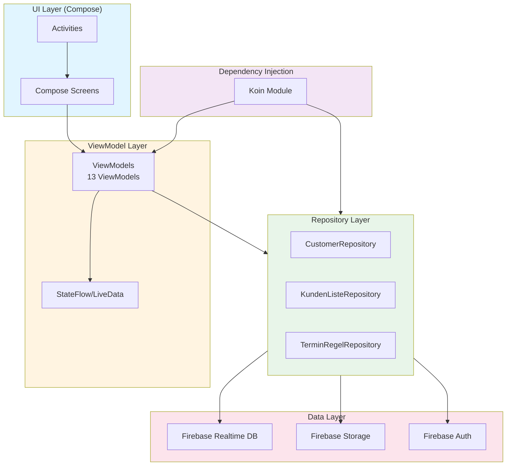

# Vollständige App-Analyse: we2026_5 (TourPlaner 2026)

**Datum:** Februar 2026  
**Projekt:** Android-App für Tourenplanung und Kundenverwaltung  
**Gesamtbewertung:** 7/10

---

## Inhaltsverzeichnis

1. [Projektübersicht](#projektübersicht)
2. [Architektur](#architektur)
3. [Stärken](#stärken)
4. [Schwächen](#schwächen)
5. [Kritische Probleme](#kritische-probleme)
6. [Code-Qualität](#code-qualität)
7. [Empfehlungen](#empfehlungen)
8. [Zusammenfassung](#zusammenfassung)

---

## Projektübersicht

### Technologie-Stack

- **Sprache:** Kotlin (Java 17)
- **UI:** Jetpack Compose (vollständig migriert) + Material3
- **Architektur:** MVVM (Model-View-ViewModel)
- **Dependency Injection:** Koin 3.x
- **Backend:** Firebase Realtime Database (Offline-Persistence aktiviert)
- **Storage:** Firebase Storage (für Fotos)
- **Auth:** Firebase Authentication
- **Coroutines:** Kotlin Coroutines für asynchrone Operationen
- **Build System:** Gradle (Kotlin DSL) mit Version Catalog

### Projektstruktur

```
app/src/main/java/com/example/we2026_5/
├── ui/                    # Compose Screens & ViewModels (13 ViewModels)
├── data/repository/       # Repository Pattern (3 Repositories)
├── di/                    # Koin Dependency Injection
├── util/                  # Utilities & Helper
├── tourplanner/           # Tour-Planer-Logik
├── adapter/              # Legacy Adapter (wird schrittweise entfernt)
└── [Activities]          # 14 Activities (alle auf Compose migriert)
```

### Hauptkomponenten

- **14 Activities** (alle auf Compose migriert)
- **13 ViewModels** (MVVM-Pattern)
- **3 Repositories** (Customer, KundenListe, TerminRegel)
- **Coordinator Pattern** für komplexe Activities (TourPlanner, CustomerDetail)

---

## Architektur

### Architektur-Diagramm



### Architektur-Patterns

#### ✅ Verwendete Patterns

1. **MVVM (Model-View-ViewModel)**
   - Klare Trennung von UI und Geschäftslogik
   - ViewModels halten State und Logik
   - Compose Screens sind reine UI-Komponenten

2. **Repository Pattern**
   - Abstraktion der Datenquelle
   - Einheitliche Schnittstelle für Datenzugriff
   - Interface-basiert (`CustomerRepositoryInterface`)

3. **Coordinator Pattern**
   - Für komplexe Activities (TourPlanner, CustomerDetail)
   - Kapselt Helper und Callbacks
   - Entlastet Activities von Geschäftslogik

4. **Dependency Injection (Koin)**
   - Zentrale Konfiguration in `AppModule`
   - ViewModels werden automatisch injiziert
   - Testbarkeit verbessert

5. **Flow-basierte Datenströme**
   - Echtzeit-Updates mit `Flow<T>`
   - Reaktive Programmierung
   - Automatische UI-Updates

#### ⚠️ Inkonsistenzen

1. **Gemischte Navigation**
   - Intent-basierte Navigation (nicht Compose Navigation)
   - Keine einheitliche Navigation-Lösung

2. **Fehlerbehandlung**
   - Toast-Aufrufe direkt in Activities (78 Stellen!)
   - Teilweise StateFlow für Fehler, teilweise Toast
   - Keine einheitliche Error-Handling-Strategie

3. **State-Management**
   - Teilweise `LiveData`, teilweise `StateFlow`
   - Inkonsistente State-Verwaltung

---

## Stärken

### 1. Moderne Architektur ✅

- **MVVM mit klarer Trennung:** ViewModels enthalten Geschäftslogik, UI ist reine Darstellung
- **Repository Pattern:** Saubere Abstraktion der Datenquelle
- **Dependency Injection:** Koin sorgt für lose Kopplung und Testbarkeit

### 2. Vollständige Compose-Migration ✅

- **Alle 14 Activities migriert:** Keine XML-Layouts mehr für neue Screens
- **Material3 Design:** Moderne UI-Komponenten
- **Dokumentation:** `COMPOSE_MIGRATION_PROTOKOLL.md` dokumentiert den Prozess

### 3. Offline-First-Ansatz ✅

- **Firebase Persistence aktiviert:** Daten werden lokal gespeichert
- **Automatische Synchronisierung:** Firebase synchronisiert automatisch im Hintergrund
- **WorkManager Integration:** Für Offline-Upload-Queue

### 4. Gute Dokumentation ✅

- **Architektur-Dokumentation:** `ARCHITEKTUR_ACTIVITY_COORDINATOR.md`
- **Migration-Protokoll:** `COMPOSE_MIGRATION_PROTOKOLL.md`
- **Projekt-Regeln:** `.cursorrules` definiert klare Richtlinien

### 5. Type-Safe Result-Wrapper ✅

- **Result<T> Klasse:** Einheitliche Fehlerbehandlung
- **AppErrorMapper:** Zentralisierte Fehler-Mapping

### 6. Coordinator Pattern ✅

- **Entlastete Activities:** TourPlanner und CustomerDetail verwenden Coordinator
- **Bessere Testbarkeit:** Geschäftslogik aus Activities herausgezogen

### 7. Flow-basierte Datenströme ✅

- **Echtzeit-Updates:** `getCustomerFlow()`, `getAllCustomersFlow()`
- **Reaktive UI:** Automatische Updates bei Datenänderungen

---

## Schwächen

### 1. Memory Leaks ⚠️ KRITISCH

#### Problem: NetworkMonitor erstellt CoroutineScopes ohne Lifecycle

**Datei:** `NetworkMonitor.kt` (Zeilen 27, 37, 51, 56, 94)

```kotlin
// PROBLEM: Erstellt neue CoroutineScopes ohne Lifecycle-Management
CoroutineScope(Dispatchers.IO).launch {
    FirebaseSyncManager.setNetworkEnabled(true)
    checkPendingWrites()
}
```

**Auswirkung:**
- Coroutines laufen weiter, auch wenn Activity zerstört wird
- Memory Leaks bei häufigen Netzwerk-Wechseln
- Potenzielle Crashes bei langem Betrieb

**Lösung:**
```kotlin
// Stattdessen: CoroutineScope als Parameter erhalten
class NetworkMonitor(
    private val context: Context,
    private val scope: CoroutineScope // Lifecycle-aware Scope
) {
    // Verwende scope.launch statt CoroutineScope(Dispatchers.IO).launch
}
```

#### Problem: CustomerPhotoManager könnte Leaks verursachen

**Datei:** `detail/CustomerPhotoManager.kt`

- Keine explizite Cleanup-Logik bei Activity-Zerstörung
- Potenzielle Leaks bei Foto-Uploads

### 2. Inkonsistente Fehlerbehandlung ⚠️ HOCH

#### Problem: 78 Toast-Aufrufe direkt in Activities

**Statistik:** 78 `Toast.makeText` Aufrufe in 23 Dateien

**Beispiele:**
- `CustomerDetailActivity.kt`: 8 Toast-Aufrufe
- `TourPlannerActivity.kt`: 1 Toast-Aufruf
- `FirebaseRetryHelper.kt`: 2 Toast-Aufrufe

**Auswirkung:**
- Schwer testbar (Toast kann nicht gemockt werden)
- Inkonsistente UX (manchmal Toast, manchmal StateFlow)
- Fehlerbehandlung nicht zentralisiert

**Lösung:**
- Snackbar in Compose verwenden
- Zentraler Error-Handler im ViewModel
- `UiState<T>` mit Loading/Error/Success

### 3. FirebaseSyncManager macht nichts ⚠️ HOCH

**Datei:** `util/FirebaseSyncManager.kt` (Zeile 43)

```kotlin
suspend fun waitForSync(): Boolean {
    // Realtime Database synchronisiert automatisch
    Log.d("FirebaseSyncManager", "Realtime Database syncs automatically in background")
    return true  // Täuscht Synchronisierung vor
}
```

**Problem:**
- Funktion gibt immer `true` zurück, macht aber nichts
- `hasPendingWrites()` gibt immer `false` zurück
- Täuscht Synchronisierung vor, obwohl keine echte Prüfung stattfindet

**Auswirkung:**
- UI zeigt "Synchronisiere..." an, obwohl nichts passiert
- Benutzer wird getäuscht über tatsächlichen Sync-Status

**Lösung:**
- Entweder echte Synchronisierung implementieren
- Oder Funktion entfernen und UI entsprechend anpassen

### 4. Race Conditions ⚠️ MITTEL

#### Problem: CustomerDetailActivity prüft loadComplete mit Delay

**Datei:** `CustomerDetailActivity.kt` (Zeile 204)

```kotlin
// PROBLEM: Magic Delay ohne Begründung
kotlinx.coroutines.delay(1000)
```

**Auswirkung:**
- Race Condition möglich
- Unzuverlässige Prüfung

### 5. Threading-Probleme ⚠️ MITTEL

#### Problem: KundenListenActivity verwendet falschen Scope

**Datei:** `KundenListenActivity.kt`

```kotlin
// PROBLEM: Erstellt neuen Scope statt lifecycleScope
CoroutineScope(Dispatchers.Main).launch { ... }
```

**Lösung:**
```kotlin
// Stattdessen:
lifecycleScope.launch { ... }
```

### 6. Hardcoded Values ⚠️ NIEDRIG

- **Magic Numbers:** Timeout 2000ms, 365 Tage, 1 Sekunde Delay
- **Hardcoded Strings:** Teilweise in `FirebaseRetryHelper`
- **Fehlende Konstanten:** Sollten in `object Constants` ausgelagert werden

### 7. Fehlende Validierung ⚠️ MITTEL

**Datei:** `CustomerRepository.kt` (Zeile 93)

```kotlin
override suspend fun saveCustomer(customer: Customer): Boolean {
    // PROBLEM: Keine Prüfung auf leere IDs
    return try {
        val task = customersRef.child(customer.id).setValue(customer)
        // ...
    }
}
```

**Auswirkung:**
- Kunden ohne ID können gespeichert werden
- Potenzielle Dateninkonsistenzen

### 8. Timeout wird als Erfolg behandelt ⚠️ MITTEL

**Datei:** `CustomerRepository.kt` (Zeilen 106-111, 135-140, 179-184)

```kotlin
catch (e: kotlinx.coroutines.TimeoutCancellationException) {
    // Timeout wird als Erfolg behandelt
    android.util.Log.d("CustomerRepository", "Save completed (timeout, but saved locally)")
    true  // Könnte problematisch sein
}
```

**Problem:**
- Timeout wird als Erfolg behandelt
- Könnte zu Inkonsistenzen führen, wenn Daten nicht wirklich gespeichert wurden

**Auswirkung:**
- Benutzer denkt, Daten sind gespeichert, aber Server hat sie nicht erhalten
- Potenzielle Datenverluste

---

## Kritische Probleme

### Priorität 1: Sofort beheben

1. **Memory Leaks in NetworkMonitor**
   - **Datei:** `NetworkMonitor.kt`
   - **Zeilen:** 27, 37, 51, 56, 94
   - **Fix:** CoroutineScope als Parameter erhalten (lifecycle-aware)

2. **FirebaseSyncManager täuscht Synchronisierung vor**
   - **Datei:** `util/FirebaseSyncManager.kt`
   - **Zeile:** 43
   - **Fix:** Entweder echte Synchronisierung oder Funktion entfernen

3. **Inkonsistente Fehlerbehandlung**
   - **Statistik:** 78 Toast-Aufrufe
   - **Fix:** Zentraler Error-Handler, Snackbar in Compose

### Priorität 2: Bald beheben

1. **Race Conditions in CustomerDetailActivity**
   - **Datei:** `CustomerDetailActivity.kt`
   - **Zeile:** 204
   - **Fix:** Magic Delay entfernen, korrekte Prüfung implementieren

2. **Threading-Probleme**
   - **Dateien:** `KundenListenActivity.kt`, `NetworkMonitor.kt`
   - **Fix:** `lifecycleScope` statt `CoroutineScope(Dispatchers.Main)`

3. **Fehlende Validierung**
   - **Datei:** `CustomerRepository.kt`
   - **Fix:** Prüfung auf leere IDs hinzufügen

### Priorität 3: Verbessern

1. **Hardcoded Values**
   - **Fix:** Konstanten in `object Constants` auslagern

2. **Magic Numbers**
   - **Fix:** Named Constants verwenden

3. **Fehlende Tests**
   - **Aktuell:** Nur Struktur-Tests vorhanden
   - **Fix:** Echte Unit-Tests und UI-Tests hinzufügen

---

## Code-Qualität

### Positiv ✅

1. **Klare Paketstruktur:** Gut organisierte Verzeichnisse
2. **Type-Safe:** Kotlin Null-Safety wird genutzt
3. **Dokumentation:** Gute Dokumentation vorhanden
4. **Deprecated-Markierungen:** Alte Felder sind markiert
5. **Result-Wrapper:** Einheitliche Fehlerbehandlung

### Verbesserungspotenzial ⚠️

1. **Logging inkonsistent:**
   - Teilweise `android.util.Log`
   - Teilweise fehlend
   - Sollte zentralisiert werden

2. **Fehlende Null-Safety-Prüfungen:**
   - An einigen Stellen fehlen explizite Prüfungen

3. **Code-Duplikation:**
   - Ähnliche Patterns wiederholen sich
   - Könnte in Utility-Funktionen ausgelagert werden

---

## Empfehlungen

### Sofort (Priorität 1)

1. **NetworkMonitor refactoren**
   ```kotlin
   class NetworkMonitor(
       private val context: Context,
       private val scope: CoroutineScope // Lifecycle-aware
   ) {
       // Verwende scope.launch statt CoroutineScope(Dispatchers.IO).launch
   }
   ```

2. **Einheitliche Fehlerbehandlung**
   - Snackbar statt Toast in Compose
   - Zentraler Error-Handler im ViewModel
   - `UiState<T>` mit Loading/Error/Success

3. **FirebaseSyncManager korrigieren**
   - Echte Synchronisierung implementieren oder entfernen
   - UI entsprechend anpassen

### Mittelfristig (Priorität 2)

1. **Navigation modernisieren**
   - Navigation Component oder Compose Navigation einführen
   - Intent-basierte Navigation ersetzen

2. **Testing erweitern**
   - ViewModel-Tests mit Mocking
   - Repository-Tests
   - UI-Tests für kritische Flows

3. **Code-Konsolidierung**
   - Deprecated-Code entfernen
   - Magic Numbers in Konstanten auslagern
   - String-Ressourcen für alle Texte

### Langfristig (Priorität 3)

1. **Architektur verbessern**
   - Use Cases für Geschäftslogik
   - Domain Layer einführen
   - Clean Architecture Prinzipien

2. **Monitoring**
   - Crashlytics Integration verbessern
   - Analytics für Nutzungsverhalten
   - Performance Monitoring

3. **Dokumentation**
   - API-Dokumentation für öffentliche Interfaces
   - Architektur-Diagramme
   - Entscheidungsprotokolle (ADRs)

---

## Zusammenfassung

### Gesamtbewertung: 7/10

**Stärken:**
- ✅ Moderne Architektur (MVVM, Compose)
- ✅ Gute Dokumentation
- ✅ Offline-First-Ansatz
- ✅ Klare Paketstruktur
- ✅ Vollständige Compose-Migration

**Schwächen:**
- ⚠️ Memory Leaks (NetworkMonitor)
- ⚠️ Inkonsistente Fehlerbehandlung (78 Toast-Aufrufe)
- ⚠️ FirebaseSyncManager täuscht Synchronisierung vor
- ⚠️ Race Conditions und Threading-Probleme
- ⚠️ Fehlende Tests

### Nächste Schritte

1. **Sofort:** Memory Leaks beheben (NetworkMonitor)
2. **Sofort:** Einheitliche Fehlerbehandlung implementieren
3. **Sofort:** FirebaseSyncManager korrigieren oder entfernen
4. **Bald:** Navigation modernisieren
5. **Bald:** Testing erweitern

### Fazit

Das Projekt zeigt eine **solide Basis** mit modernen Android-Praktiken. Die Hauptprobleme liegen in **Details der Implementierung** (Lifecycle-Management, Fehlerbehandlung) und können **schrittweise behoben** werden. Die Architektur ist gut durchdacht, aber es gibt noch **Verbesserungspotenzial** bei der Konsistenz und Robustheit.

---

**Erstellt:** Februar 2026  
**Letzte Aktualisierung:** Februar 2026
